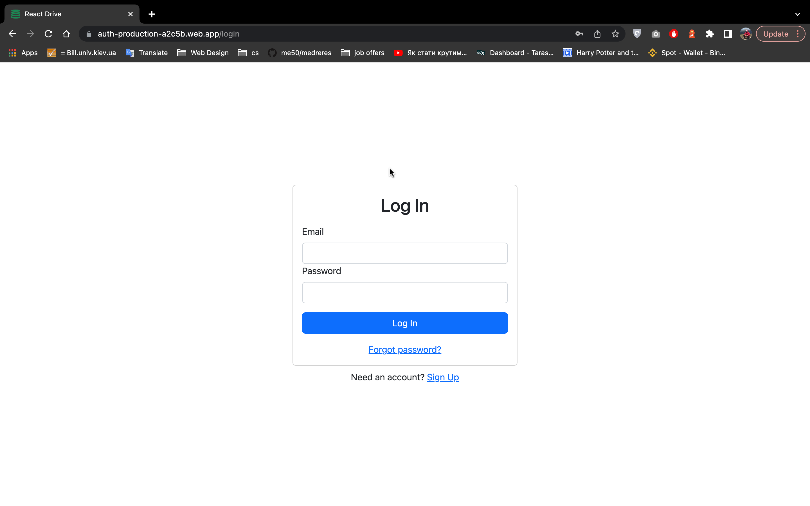
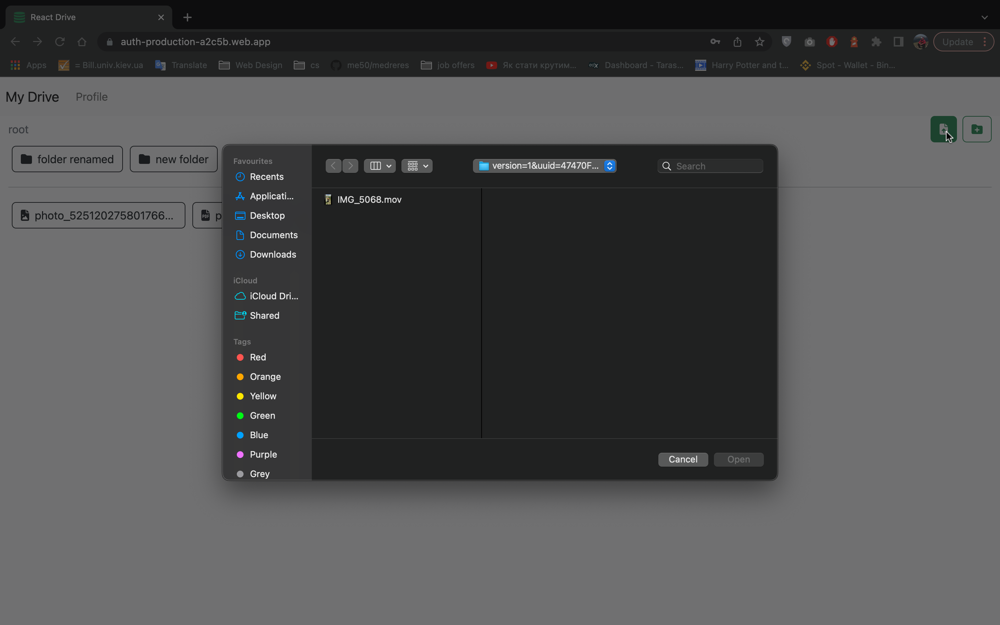
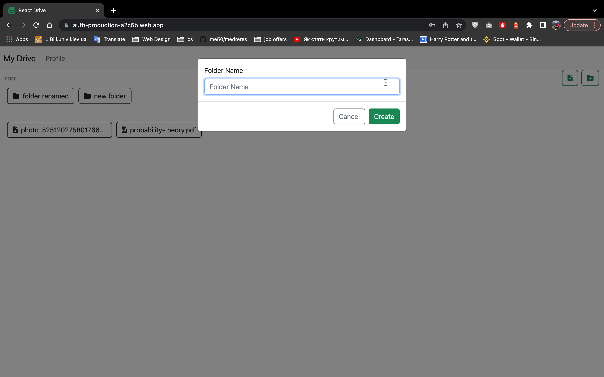
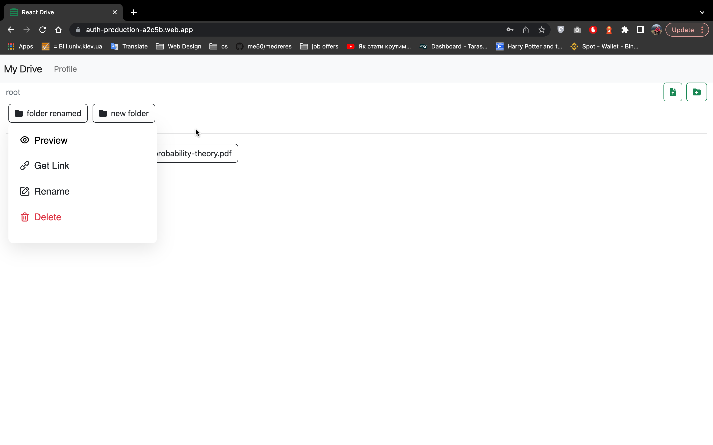

# React Drive

A React.js app with functionality, you'd expect from any online storage: deleting, renaming, adding and sharing files. [Demo verison](https://auth-production-a2c5b.web.app/) to poke around!


# Installation

To start the app simply run those commands

```
npm i
npm run start
```

# Features

- Icon support for different formats
- Custom context menu for files with delete, rename and share support
- Firebase Authentication
- Password reset

# Projects aims

A study project to get the grasp of Firebase API, polish off the knowledge of React and create personal online storage

# Example of use

## Authentication

Enter your email address and password of your account, if you have one. If not, you can use demo account:
Email: 
```
maxum23025@gmail.com
```
Password: 
```
maxum320
```




## Adding file

Click on the icon on the right to add a file


## Adding folder

Click on the icon on the right to add a folder and enter the folder name


## Context menu

Right click on either file or folder to open the context menu


# Technologies

- React v18
- Bootstrap v5.0
- Firebase
- Font Awesome

# Sources

Those sources gave a gread deal of inspiration while developing

- [Web Dev Simplified](https://youtu.be/6XTRElVAZ9Y)
